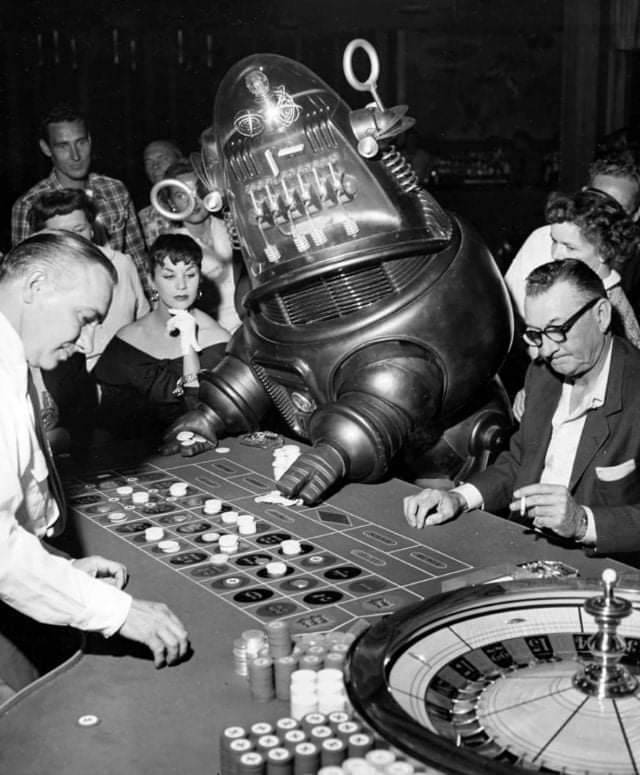

## Ready Set Bot!

You and your group members must design a betting strategy for a bot for the game Ready Set Bet which runs **autonomously**, meaning that there is no human input.
Your strategy should have rules which clearly identify:
1. Under what conditions a bet will be placed.  Does it depend on the horse positions?  Does it depend on how many other bets were made?  Carefully describe how!
2. What token will be used to bet for each bet.  Remember which ones are available!
3. What position you will bet on for each bet.  Ignore the exotic and prop bets and just consider the basic board.  Remember, someone might take your desired position first, so what do you do then?

Additional timing rules: if two bots would be made to place in the same position simultaneously, for example at the start of the game, then the order of bets will be resolved randomly.

Your bot should be written so clearly that your instructor is able to program it in Python.

